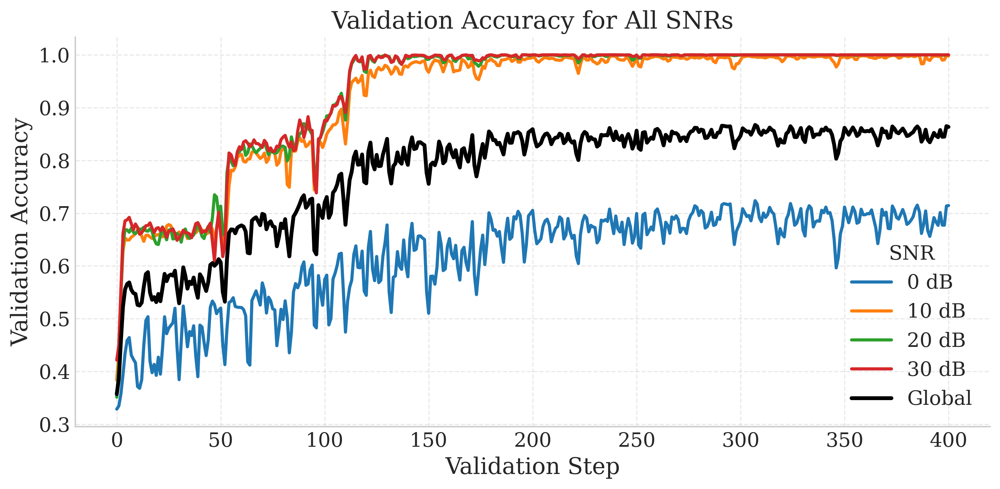
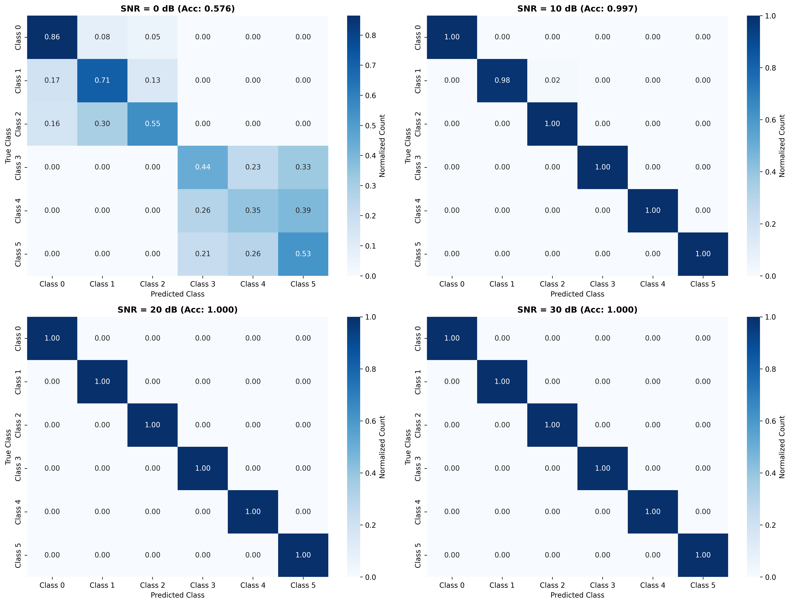
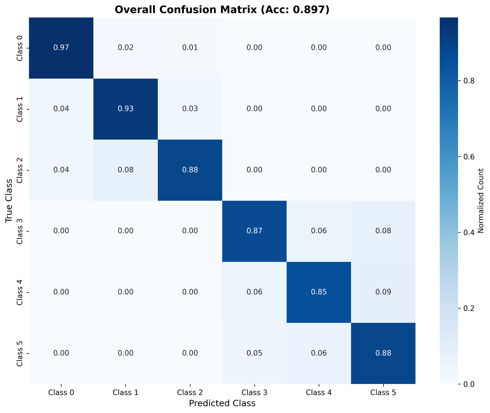

# Rapport de Projet : Classification de Signaux Radio par Deep Learning

**Auteurs** : Iliass LASRI et Marine VIEILLARD

## 1. Introduction

Ce projet porte sur la classification automatique de signaux radio. L'objectif est de classifier 6 types de modulations différentes (BPSK, QPSK, 8PSK, 16QAM, 64QAM, GMSK) à partir de leurs représentations I/Q (In-phase/Quadrature).

La difficulté majeure réside dans la variabilité du rapport signal sur bruit (SNR), qui varie de 0 dB (signal très bruité) à 30 dB (signal clair). Les performances du modèle doivent donc être robustes à ces variations.

## 2. Données

### 2.1 Structure des données
- **Ensemble d'entraînement** : 30200 échantillons (train.hdf5 + samples.hdf5)
- **Ensemble de validation** : validation.hdf5
- **Ensemble de test** : test.hdf5
- **Format** : Signaux I/Q de longueur 2048, représentés en 2 canaux (I et Q)
- **SNR** : 4 valeurs distinctes (0, 10, 20, 30 dB)
- **Classes** : 6 types de modulation

### 2.2 Augmentation des données
Pour améliorer la généralisation, nous avons implémenté deux techniques d'augmentation :

1. **Rotation I/Q aléatoire** : Rotation aléatoire du signal dans l'espace I/Q (angle entre 0 et 2π)
   - Simule une phase aleatoire inhérente aux transmissions radio pour que le modele n'apprend pas de feature sur la phase
   - Appliquée tout le temps.

2. **Dégradation SNR adaptative** : Ajout de bruit pour simuler des conditions plus difficiles
   - SNR 30 dB → peut être dégradé en 20, 10 ou 0 dB
   - SNR 20 dB → peut être dégradé en 10 ou 0 dB
   - SNR 10 dB → peut être dégradé en 0 dB
   - cette augmentation est appliquée avec probabilité 50%

**Impact de l'augmentation** :
- L’augmentation de données accélère la généralisation du modèle, ce qui permet de réduire le temps d’entraînement : nous obtenons de meilleures performances sur l’ensemble de validation en un tiers du temps d’entraînement.
- Nous obtenons 3% d'amélioration de précision sur l’ensemble de test, toujours avec seulement un tiers du temps d’entraînement.

## 3. Architecture des Modèles

### 3.1 Modèle CNN-LSTM avec SNR (Architecture finale)

```
Input: [Batch, 2, 2048] (signaux I/Q dans le domaine temporelle)
SNR: [Batch, 1] (valeur du SNR)

├─ Conv1D Block 1: 2 → 32 channels (kernel=7, stride=2)
│  └─ BatchNorm + ReLU
│
├─ Conv1D Block 2: 32 → 64 channels (kernel=5, stride=2)
│  └─ BatchNorm + ReLU
│
├─ LSTM bidirectionnel: 64 → 64*2 hidden units
│  └─ Mean pooling sur dimension temporelle
│
├─ SNR Embedding: SNR → 16 features
│
├─ Concatenation: [LSTM features (128) + SNR features (16)]
│
├─ FC1: 144 → 128 + ReLU
│
└─ FC2: 128 → 6 classes (output logits)
```

**Caractéristiques principales** :
- Extraction de features par CNN 1D
- Modélisation des dépendances temporelles par LSTM bidirectionnel
- Intégration du SNR comme information contextuelle
- 96,902 paramètres

### 3.2 Modèles alternatifs explorés

#### ResNet 1D
- Blocs résiduels avec skip connections
- Architecture plus profonde (4 layers avec doublement progressif des filtres)
- Global Average Pooling
- Intégration du SNR en fin de réseau
- Meilleure pour capturer des patterns complexes, mais plus coûteux

#### CNN progressif simple
- Séquence de Conv1D avec réduction progressive de la dimension temporelle
- Plus léger mais moins performant

#### STFT-CNN-LSTM
- Transformation en domaine fréquentiel via STFT
- CNN 2D sur le spectrogramme
- **Performances médiocres** : La STFT n’a pas apporté de performance significative car les signaux I/Q utilisés sont relativement courts (2048) et fortement bruités La transformation en spectrogramme entraîne une perte d’information fine sur l’amplitude instantanée, qui sont essentielles pour distinguer certaines modulations. De plus, la résolution temporelle et fréquentielle du STFT est limitée, ce qui réduit la capacité du CNN à capturer les variations rapides caractéristiques des modulations complexes.

## 4. Entraînement

### 4.1 Hyperparamètres
- **Batch size** : 512
- **Optimizer** : Adam
- **Loss** : CrossEntropyLoss
- **Epochs** : 500 (avec checkpoints tous les 50 epochs)
- **Device** : GPU (CUDA)

### 4.2 Gestion du SNR

Trois approches testées :

1. **Inclusion du SNR dans le modèle** (approche retenue)
   - Le modèle reçoit la valeur du SNR en input
   - Permet au modèle d'adapter sa prédiction selon le niveau de bruit

2. **Exclusion des échantillons SNR=0 dB ou Entraînement sur un seul SNR**
   - Testée pour voir si l'entrainement du modèle est degradée a cause de la difficulite des  échantillons avec 0dB, la conclusion est que cela ne change pas la performance du modele sur la validation, on constate meme une légère dégradation les performances globales.

### 4.3. Entraînement extensive pour une meilleure performance
<p align="center">
  
</p>

Les plateaux intermédiaires observés dans le graphe de validation accuracy peuvent s’expliquer par le processus d’apprentissage du modèle. Au début de l’entraînement, le modèle apprend rapidement les motifs les plus évidents, ce qui entraîne une hausse rapide de l’accuracy. Ensuite, à mesure qu’il rencontre des exemples plus complexes ou moins fréquents dans les données, il doit ajuster ses représentations internes pour mieux les capturer. Cette phase d’ajustement se traduit par un ralentissement temporaire de l’accuracy, créant des plateaux. Une fois que le modèle réussit à intégrer ces nouvelles structures et variations, l’accuracy reprend sa progression jusqu’à atteindre une performance stable sur l’ensemble de validation. Ces plateaux reflètent donc la phase de consolidation et d’adaptation du modèle aux aspects plus complexes des données.


## 5. Résultats

### 5.1 Performance globale

#### Configuration : SNR en input avec augmentation SNR et Phase
```
Test Accuracy : 89.64%
```

**Accuracy par classe** :
- Classe 0 : 95.52%
- Classe 1 : 95.88%
- Classe 2 : 86.57%
- Classe 3 : 88.75%
- Classe 4 : 85.23%
- Classe 5 : 84.06%

**Accuracy par SNR** :
- **SNR 0 dB**  : 56.78% 
- **SNR 10 dB** : 99.23%
- **SNR 20 dB** : 100.00%
- **SNR 30 dB** : 100.00%

#### Configuration : SNR en input sans augmentation
```
Test Accuracy : 86.57%
```

**Accuracy par SNR** :
- **SNR 0 dB**  : 46.53%
- **SNR 10 dB** : 98.15%
- **SNR 20 dB** : 99.96%
- **SNR 30 dB** : 100.00%

### 5.2 Analyse des résultats

#### Points forts
1. **Excellentes performances à SNR élevé** : >99% d'accuracy à 20 et 30 dB
2. **Robustesse au bruit** : Même à 0 dB, le modèle atteint ~57% d'accuracy (vs 16.7% aléatoire)
3. **Équilibre entre classes** : Pas de déséquilibre majeur (85-95%) dans la performance de classification

#### Points d'attention
1. **SNR 0 dB** : Performance limitée mais attendue cpmme signal est fortement dégradé
2. **Matrice de confusion** : Confusions principalement entre classes proches
   - Classes 0-1-2 (modulations PSK)
   - Classes 3-4-5 (modulations QAM/GMSK)

<p align="center">
  
  
</p>


## 6. Conclusions et Perspectives

Le projet a permis de développer un système de classification robuste atteignant 89% d'accuracy globale, avec d'excellentes performances à SNR élevé (>99% à 20-30 dB).

Apports de l'approche:  
- L'intégration du SNR comme feature et le travail dans le domaine temporelle améliore significativement les performances
- L'augmentation de données (phase aléatoire) accélère l'entraînement et améliore la généralisation, et l'augmentation de données en  dégradant le SNR ameiolre la performance surtout dans le cas de 0dB SNR comme on a plus de données d'entrainement avec 0dB SNR.
- L'architecture CNN-LSTM capture efficacement les patterns temporels


## 7. Références du Code

### Structure des fichiers
```
.
├── train.py 
├── test.py
├── dataset.py            # DataLoader et augmentation
├── models.py
├── README.md
└── test_results          # quelques résultats des modèles
```

### Commandes principales

**Entraînement** :
```bash
python train.py --name training
python train.py --load runs/checkpoints/checkpoint.pt  # Reprendre depuis checkpoint
```

**Évaluation** :
```bash
python test.py --checkpoint runs/20241121-123456_run/checkpoint.pt \
                    --test test.hdf5
```

---

